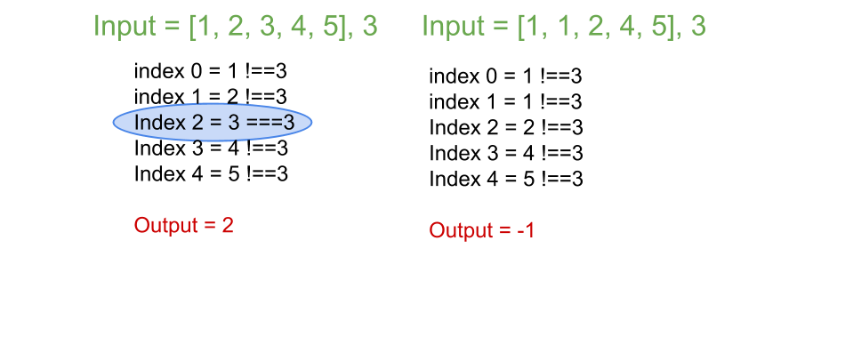

# Binary Search

## Problem
Given a sorted (in ascending order) integer array nums of n elements and a target value, write a function to search target in nums. If target exists, then return its index, otherwise return -1.

## Visual



## Algorthism
* Make a function that has accapt an array and a target value.
* Make a for loop that go through the array.
  * If the target value matchs an array value.
    * return the index.
* Other wise return -1

## Pseudocode
```
START search <-- FUNCTION(INPUT<-- array, target)
  FOR i<-- 0 to the length of array
    IF target === array[i]
      OUTPUT [i]
    END IF
  END FOR
  OUTPUT -1
END
```
## Code
 Click the the "[Link](binarySearch.js)" to view the the code. 