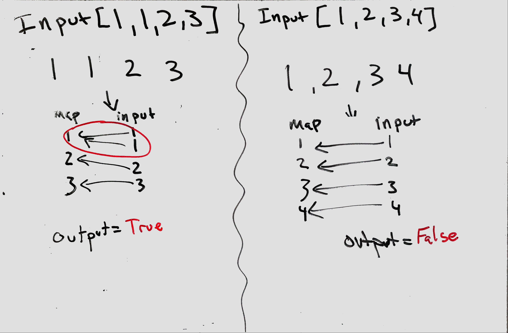

## Contains Duplicates
Given an array of integers, find if the array contains any duplicates.

Your function should return true if any value appears at least twice in the array, and it should return false if every element is distinct.

### Visual
<p align="center">

</p>

### Algorthism
* Create a funtion that takes an intake of an array
* Create a Hashmap
  * a variable that is an empty object(or array).
* Create a for loop.
  * if hashmap contains index valuse of input array.
    * return ture
  * set hashmap index to contain the input array's index as ture 
* Otherwise return false.

### Psudocode
````
START function(INPUT<--array)
  map <-- []
  FOR i <-- 0 to length of array
    IF map[array[i]]
      RETURN OUTPUT <--ture
    END IF
    map[array[i]] <-- ture
  END FOR
RETURN OUTPUT <-- false
END
````
### Code
 Click the the "[Link](containsDuplicates.js)" to view the the code. 
