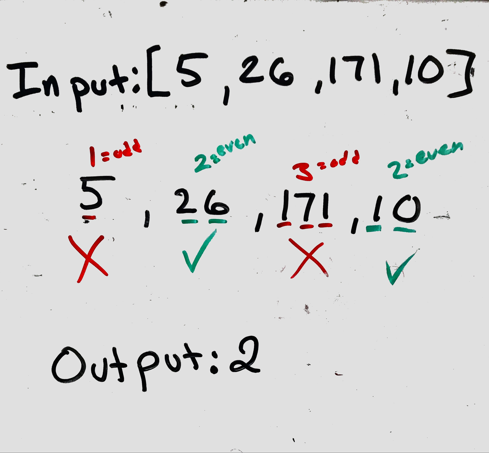

##  Find Numbers with Even Number of Digits

#### Problem
Given an array nums of integers, return how many of them contain an even number of digits.

#### Visual
<p align="center">

</p>

#### Algorthism

* Create a function that takes an array
* Set a counter to keep track of the even digits
* Make a loop to go through the array
* Check the length of the digits
  * if the length is even add to the counter
  * if not move on
* return the counter

#### Psudocode
````
functiom(arr)
  counter <-- 0
    FOR i <--0 to length of array
      IF arr[i].toString().length % 2 === 0
      counter++
      END IF
    END FOR
  RETURN counter
END
````

#### Code
 Click the the "[Link](findNumber.js)" to view the the code. 