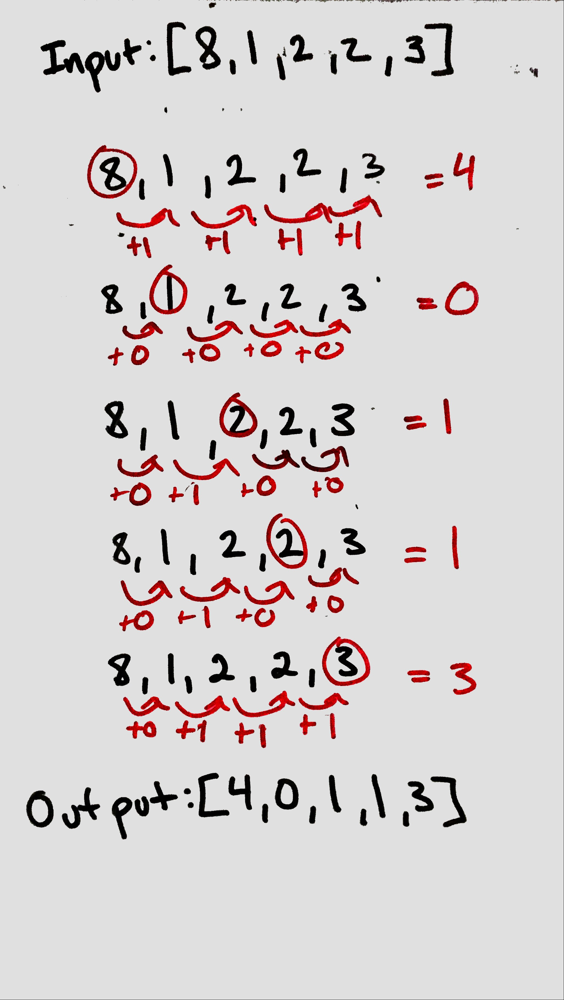

## How Many Numbers Are Smaller Than the Current Number

### Problem

Given the array nums, for each nums[i] find out how many numbers in the array are smaller than it. That is, for each nums[i] you have to count the number of valid j's such that j != i and nums[j] < nums[i].

Return the answer in an array

### Visual
<p align="center">

</p>

### Algorthism

* Create a fuction that takes an array
* create variable to hold new array
* Create a nested array
  * In the frist loop:
    * Set a counter
  * In the second loop:
    * Compare the indexs of the frist and second loop.
    * If the index of the sencond loop is less then the frist add to the conuter.
* Push the counter to the new array
* Reset the counter
+ return the new array

### Psudocode
```
START FUNCTION (INPUT <-- array)
  results <-- []
  FOR i <-- 0 to array.lengths
    counter <-- 0
    FOR j <-- 0 to array.length 
      IF [j] < [i]
      counter++
      ENDIF
    END FOR
    results.push <--counter
    couter <-- 0
  END FOR
  RETURN OUTPUT <-- results
END FUNCTION
```

### Code
 Click the the "[Link](howManySmaller.js)" to view the the code. 