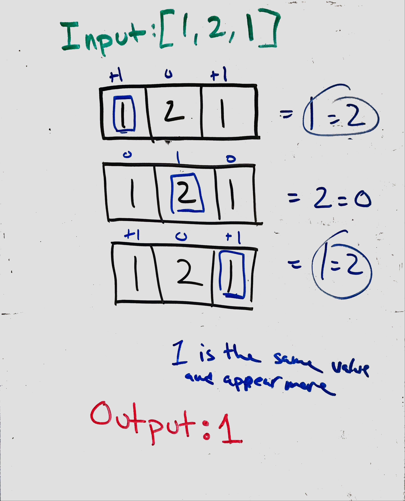

# Majority Element

## Problem
Given an array of size n, find the majority element. The majority element is the element that appears more than ⌊ n/2 ⌋ times.

__*Note*__ : You may assume that the array is non-empty and the majority element always exist in the array.

## Visual
<p align="center">

</p>
### Algorthism
* Make a function that take an array as an input.
  * If input is not an array return null. 
* set a counter to one
* set majority element(mElement) to value of array index at 0
* Make a for loop 
  *  If mElement is not the value array index and conut is zero
      * add to the count
      * set mElement to the value of array index
  * Else if mElement is not the value of array index and count is not 0
      * subtract to from the count 
  * Else add to the count.
* Return the mElement

## Pseudocode
````
Start majorityElement <-- Function(INPUT<-- array)
  If !array <-- RETURN null
  count <-- 1
  mElement <-- array[0]
  FOR i<-- 1 to the length of array
    IF mElement !== array[i] AND count === 0 THEN
      INCREMENT count
      mElement <-- array[i]
    ELSE IF mElement !== array[i] AND count !== 0 THEN
      DECAMENT count
    ELSE 
       INCREMENT count
    END IF
  END FOR
  RETRUN mElement
END FUNCTION
````
## Code
 Click the the "[Link](majorityElement.js)" to view the the code. 
 <hr>

[⏎ Back to Array index ](../README.md) 

[〈 Previous: How Many Numbers Are Smaller Than The Current Number](../howManySmaller/README.md) | [Next: Merge Sorted Array 〉](../marge/README.md)