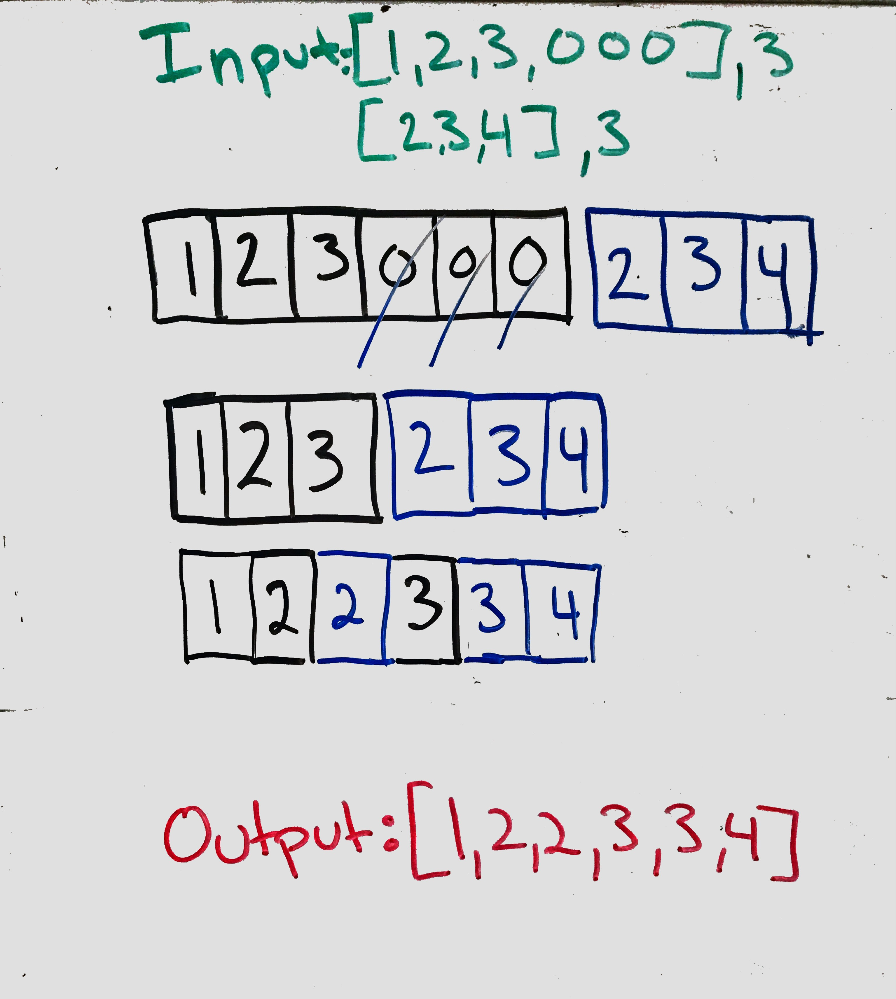

# Merge Sorted Array

## Problem
Given two sorted integer arrays nums1 and nums2, merge nums2 into nums1 as one sorted array.

__*Note:*__
* The number of elements initialized in nums1 and nums2 are m and n respectively.
* You may assume that nums1 has enough space (size that is greater or equal to m + n) to hold additional elements from nums2.

## Visual
<p align="center">

</p>
### Algorthism
* Make a function that take in 2 arrays with a number of elements of each one (m and n)
* If n equal zero return array 1
* Decament m
* Decament n
* While n is greater or equal of 0
* If array 1 index value of m is greater then array 2 index value of n
  * Array one index value of m plus n plus 1 equal array one index value m
  * Decament m
* Else array 1 index value of  m plus n plus 1 equal array2 index value of n
  * Decament n 

## Pseudocode
````
START merge <-- FUNCTION (INPUT<-- arr1,m,arr2,n )
  IF n === 0 RETURN
  DECAMENT m
  DECAMENT n
  WHILE n >= 0
    IF arr1[m] > arr2[n] THEN
      arr1[m+n+1] <-- arr1[n]
      DECAMENT m
    ELSE
      arr1[m+n+1] <-- arr2[n]
      DECAMENT n
    END IF
  END WHILE
END FUNCTION
````

## Code
Click the the "[Link](marge.js)" to view the the code. 
<hr>

[⏎ Back to Array index ](../README.md) 

[〈 Previous: Majority Element](../majorityElement/README.md) | [Next: Max Consective Ones 〉](../MaxConsecitiveOne/README.md)