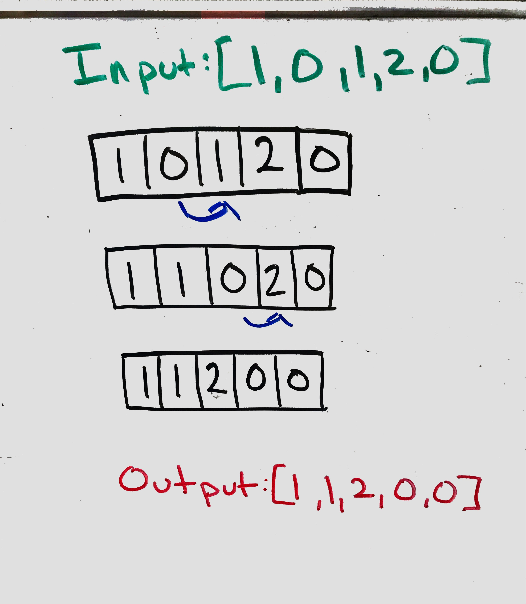

## Move Zeroes

### Problem
Given an array nums, write a function to move all 0's to the end of it while maintaining the relative order of the non-zero elements.

### Visual
<p align="center">

</p>
### Algorthism
* Make a function that take in an array
* set a counter 
* Make a for loop
  * If the array's index value is not zero
   * Then array index incerment the count now is array index value
* While the count is less the length of the array
  * array index incerment the count  is zreo
* Return the array

### Pseudocode
```
START moveZeroes <-- FUNCTION(INPUT <-- array)
  count <-- 0
  FOR i <--0 to the length of the array
    IF array[i] !== 0
      array[count INCERMENT] <-- array[i]
    END IF
  END FOR
  WHILE count < length of array
    array[count INCERMENT] <-- 0
  END WHILE
  OUTPUT<-- RETURN array
END FUNCTION
```


### Code
Click the the "[Link](moveZeros.js)" to view the the code. 