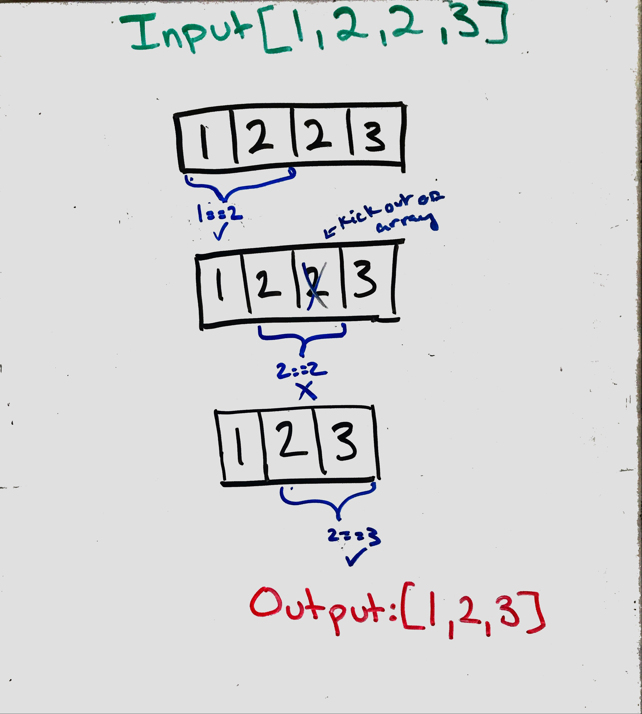

## Remove Deplicates from Sorted Array

### Problem
Given a sorted array nums, remove the duplicates in-place such that each element appear only once and return the new length.

__*Note*__:<br>
Do not allocate extra space for another array, you must do this by modifying the input array in-place with O(1) extra memory.

### Visual 
<p align="center">

</p>
### Algrothism
* Make a function the take in an array of numbers
* Chack the length of the array is greater then 0
  * if not return 0
* Define i as 0 as a pointer
* Make a for loop which acts as a second pointer
    * check the index value array frist and second pointers
       * if not the same 
        * incerment the frist poniter
        * set the value of the frist point to the sencond
* Return the value of frist pointer plus one.

### PseudoCode 
````
START removeDuplicates <-- FUNCTION(INPUT<-- array)
  IF length of array === 0
    OUTPUT <-- RETURN 0
  END IF
  i <-- 0
  FOR j <-- 0 to the length of array
    IF array[j] !== array[i]
      INCERMENT i
      array[i] <-- array[j]
    END IF
  END FOR
  OUTPUT <-- i+1
END FUNCTION
````
### Code
Click the the "[Link](removeDuplicates.js)" to view the the code. 