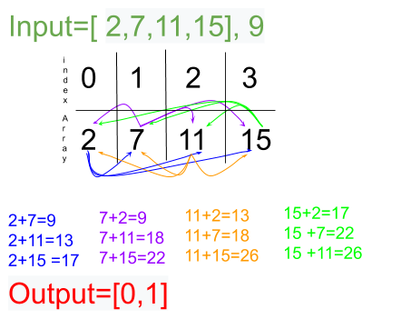

# Two Sum
## Problem
Given an array of integers, return indices of the two numbers such that they add up to a specific target.

__*Note*__:<br>
You may assume that each input would have exactly one solution, and you may not use the same element twice.

## Visual
<p align="center">

</p>

## Algorthism
* Make a function that takes an array and target
* Use a for loop as the frist pointerß
* Then another for loop as a second
  * check if index value of the frist loop plus the the index value of the second equal the target
  * if so return the index value of i and j

## Pseudocode
```
START twoSum <-- ßFUNCTION (INPUT <-- array, target)
  FOR i<-- 0 to the length of the array
    FOR j<-- 1 to the length of the array
      IF array[i] + array[j] === target
        OUTPUT<-- return [i,j]
      END IF
    END FOR
  END FOR
END FUNCTION
```

## Code
Click the the "[Link](twoSum.js)" to view the the code. 
<hr>

[ ⏎ Back to Array index ](../README.md) 

[〈 Previous:Squares of a Sorted Array](../sortSquares/README.md) | [Next: Vaild Mountain Array 〉](../vaildMonuntainArray/README.md)

