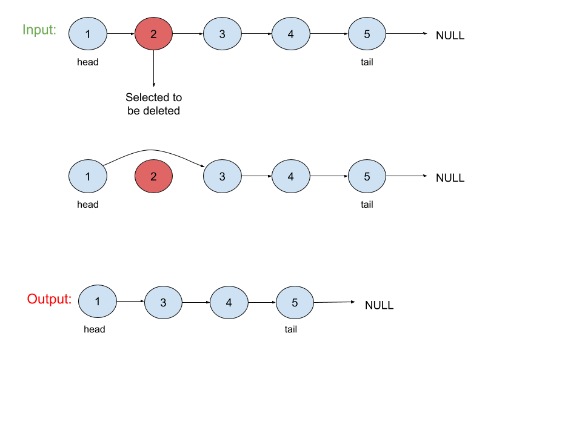

# Delete Node in a LinkList

## Problem
Write a function to __delete a node__ in a singly-linked list. You will __not__ be given access to the head of the list, instead you will be given access to __the node to be deleted directly__.

*__Note__*:<br>
It is guaranteed that the node to be deleted is not a tail node in the list.

## Visual


## Algorthism 
* Make a function that take in a node.
* Define node.value as node.next.value
* Define node.next as node.next.next

## Pseudocode 
```
START FUNCTION(INPUT <-- node)
    node.val <-- node.next.val
    node.next <-- node.next.next
END 
```

## Code

Click the the "[Link](deletenodeLL.js)" to view the the code.

<hr>

[ ⏎ Back to Linked List index ](../README.md) 

[〈 Previous: Convert Sorted List to Binary Search Tree](../convertSortLLtoBST/README.md) | [Next: Middle of the Linked List 〉](../middleLL/README.md)
