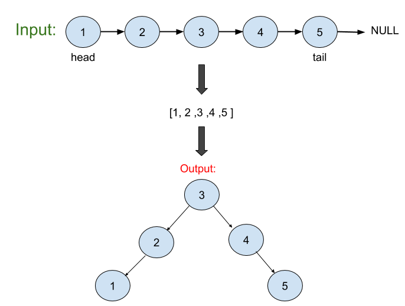

# Convert Sorted Linklist to a Binary Search Tree

## Problem
Given the head of a singly linked list where elements are sorted in ascending order, convert it to a height balanced BST.

*__Note__*:<br>
For this problem, a height-balanced binary tree is defined as a binary tree in which the depth of the two subtrees of every node never differ by more than 1.

## Visual



## Algorthism
* Make a function that take a link-list.
* Difine an empty array to push values from the link-list to.
* While as at the head of the link-list.
    *  push values into the array.
* Make a new function that makes the tree with values in the array.
* Check if the length is 0.
    * if so, return 'null'.
* Check if the length is 1.
    * if so, return tree with value of arr.
* Defin the middle of the arr.
* Defin the root of the tree
* Using the a recursive method:
    * Define the left as the function with input of slice from index value of zero to middle.
    * Define the right as the function with input of slice from index value of middle to the end.
    * return the root.
* return the tree function with the input of the vals.

## PseudoCode
```
START FUNCTION (INPUT <-- HEAD)
		vals <-- []
		WHILE(HEAD)
			vals.push <-- head.val
			head <-- head.next
		END WHILE
		FUNCTION(INPUT <-- array)
			IF array.length ==== 0
				RETURN NULL
			END IF
			IF array.length === 1
				RETURN new TreeNode(arr[0])
			END IF
			mid <-- Math.floor(array.length / 2)
			root <-- new TreeNode(array[mid])
			root.left <-- FUNCTION(array.slice(0, mid))
			root.right <-- FUNCTION(array.slice(mid + 1))
			RETURN root
		END FUNCTION 
	RETURN FUNCTION(vals)
END FUNCTION
```
## Code
Click the the "[Link](convertSortLLtoBST.js)" to view the the code.

<hr>

[⏎ Back to Linked List index ](../README.md) 

[Next: Delete Node in a LinkList 〉](../DeletenodeLL/README.md)

