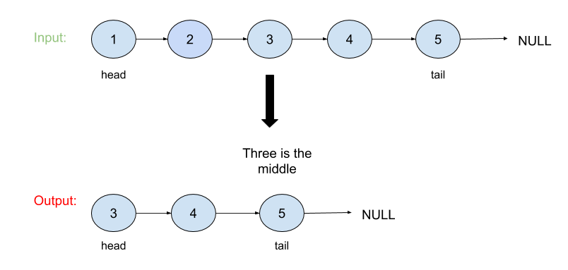

# Middle of the Linked List

## Problem
Given a non-empty, singly linked list with head node head, return a middle node of linked list.

*__Note__*:<br>
If there are two middle nodes, return the second middle node.

## Visual


## Algorthism
* Make a Function that accept a linked list.
* Check if the input is a linked list.
* Make a function that count the length of the linked list.
    * Set a counter.
    * Traverse through the linked list.
        * Counting how many nodes.
    * Return the counter.
* Make a funtion that take a input of a node and middle.
    * Define current as the head.
    * For the length of the middle go to the nexted node.
    * Return node.
* Define middle as length of the linked list divide by two.
* Return with funtion that take the linked list and middle.

## Pseudocode
```
START middleNode <--FUNCTION (INPUT <-- head of linked list)
  IF head === null
    RETURN head
  END IF
  START counterLength <-- FUNCTION(INPUT <-- node)
    counter <-- 0
    WHILE(node.next)
      counter++
      node <-- node.next
    END WHILE
    OUTPUT RETURN counter
  END FUNCTION
  START nodeThatIsInTheMiddle <-- FUNCTION(INPUT<-- node, middle)
    current <-- this.head
    FOR i <-- 0; i <  middle
      node <-- node.next
    END FOR
    OUTPUT RETURN node
  END FUNCTION
  middle <-- Math.ceil(counterLength (head)/2)
  OUTPUT RETURN nodeThatIsInTheMiddle(head, middle)
END 
```

# Code
Click the the "[Link](middleLL.js)" to view the the code.
