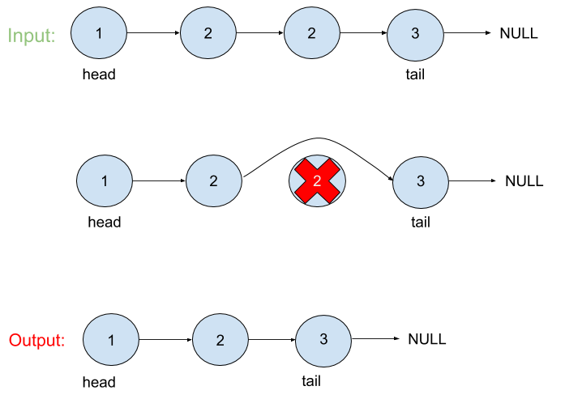

# Remove Duplicates from Sorted Linked List

## Problem
Given a sorted linked list, delete all duplicates such that each element appear only once.
 
## Visual


## Algorthism
* Make a function that take in a linked list.
* Check the input is a linked list.
* Define an empty array.
* Set current to head of the linked list.
* Set the pervious as null.
* Traverse through the linked list.
  * check if it is already in the array.
    * skip the node.
	* If not push the node to the array
* Return the link list

## Pseudocode
```
START deleteDuplicates <-- FUNCTION (INPUT<-- head of linklist)
	IF head === NULL OR head.next === NULL
		OUTPUT <-- RETURN head
	END IF
	arr <-- []
	curr <-- head
	per <-- null
	WHILE curr
		IF arr.include(curr.val)
			pev.next <-- curr.next
		END IF
		ELSE
			arr.push(curr.val)
			pev <-- curr
		END ELSE
		curr <-- curr.next
	END WHILE
	OUTPUT <-- RETURN head
END
```

## Code
Click the the "[Link](removeDuplicates.js)" to view the the code.

Click "[here](../README.md)" to get back to the index page for 'Linked List'
