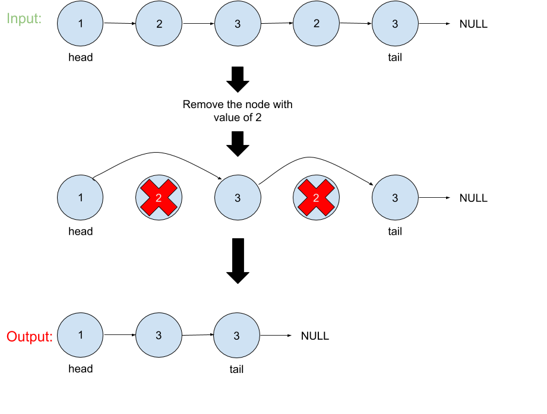

# Remove Linked List Elements

## Problem
Remove all elements from a linked list of integers that have value __val__.

## Visual

## Algorthism
* Make a function that take an input of a linked list and a value.
* Check input is a linked list
