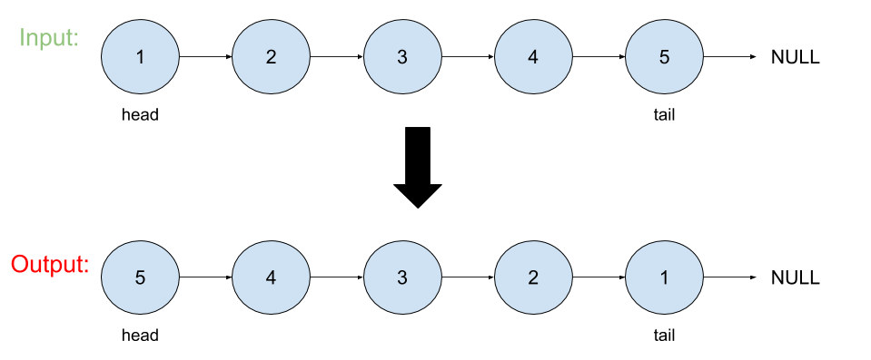

# Reverse Linked List

## Problem
Reverse a singly linked list.
## Visual

## Algorthism
* Make a function with the input being a linked list.
* Check that it is a linked list.
  * If not return null.
* Define current as head.
* Define tail as null.
* While current is not null.
  * Define pervious as current.next.
  * Define current.next as tail.
  * Define tail as current.
  * Define  current as pervious.
* Return tail.
## Psuedocode
```
START reverseList <-- FUNCTION(INPUT<-- head) 
  IF head === null
    OUTPUT <-- RETURN head
  END IF
  current <-- head
  tail <-- NULL
  WHILE current !== NULL
    perv <-- current.next
    current.next <-- tail
    tail <-- current
    current <-- perv
  END WHILE
  OUTPUT <-- RETURN tail
END 
```
## Code
Click the the "[Link](reversell.js)" to view the the code.

<hr>

[ ⏎ Back to Linked List index ](../README.md) 

[〈 Previous: Remove Linked List Elements](../removeLLelements/README.md) 

