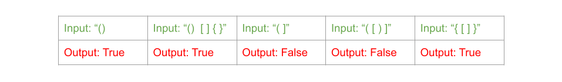

# Valid Parentheses

## Problem
Given a string s containing just the characters '(', ')', '{', '}', '[' and ']', determine if the input string is valid.

An input string is valid if:

1. Open brackets must be closed by the same type of brackets.
2. Open brackets must be closed in the correct order.
 
## Visual

## Algorthism
 * Create a function that take in a string(s) containing differnt type of praentheses( '(',')','{', '}','[',']') 
* Create an empty array
* Make a for loop
  * Define p as index value of s
  * If p matches '(', then push ')' into stack 
  * If p matches '[', then push ']' into stack 
  * If p matches '{', then push '}' into stack 
  * Else pop from the stack if dose not match p and return false
* Retrun stack legth equal 0
## Psuedocode
```
START isValid <-- FUNCTION(INPUT<-- s <--string)
  stack <-- []
  FOR i <-- 0 i < length of s i++
    p <-- s[i]
    IF p === '('
      push ')' into stack
    End IF
    IF p === '{'
      push '}' into stack
    End IF
    IF p === '['
      push ']' into stack
    End IF
    ELSE 
      IF(pop from stack !==p) RETURN false
    END ELSE
  END FOR
  OUTPUT <-- RETURN stack.length === 0
END 
```
## Code
Click the the "[Link](reversell.js)" to view the the code.

<hr>

[ ⏎ Back to Linked List index ](../README.md) 

[〈 Previous: Remove Linked List Elements](../removeLLelements/README.md) 
