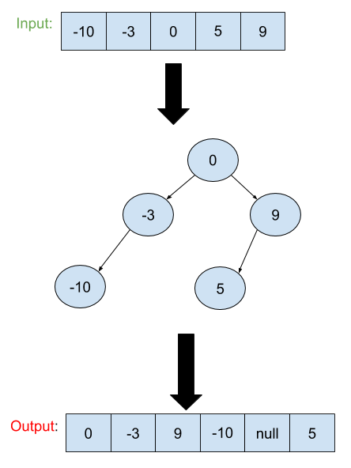

# Convert Sorted Array to Binary Search Tree
## Problem
Given an array where elements are sorted in ascending order, convert it to a height balanced BST.

For this problem, a height-balanced binary tree is defined as a binary tree in which the depth of the two subtrees of every node never differ by more than 1.

## Visual

## Algorthism
* Create a function that take an array.
* Check if it is an array.
  * if not return null.
* Define middle as the length of the array divide by 2.
* Define root as a new tree array index value at the middle.
* To go to the left call the function with input of array.slice at 0 to the middle.
* To go to the right call the function with input of array.slice at middle to the end.
* return root.
## Pseudocode
```
START sortedArrayToBST <-- function(INPUT <-- array)
  IF !array.length OR array <-- null
    RETURN NULL
  END IF
  middle <-- Math.floor(array.length / 2)
  root <-- new TreeNode(array[middle])
  root.left <-- sortedArrayToBST(array.slice(0,middle))
  root.right <-- sortedArrayToBST(array.slice(middle + 1))
  OUTPUT <-- RETURN root. 
```

## Code
Click ["here"](arrayToBST.js) to see the code.
<hr>

[⏎ Back to Trees index ](../README.md) 

[Next: Maximum Depth of Binary Tree 〉](../maxDepth/README.md)