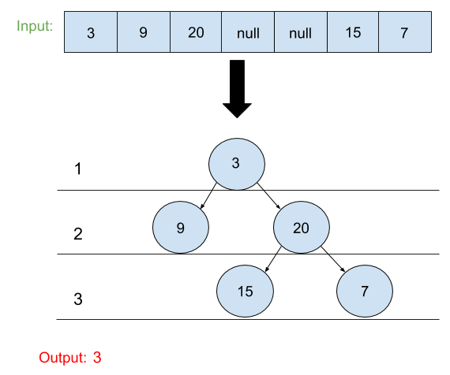

# Maximum Depth of Binary Tree
## Problem
Given a binary tree, find its maximum depth.

The maximum depth is the number of nodes along the longest path from the root node down to the farthest leaf node.

*__Note__*:<br> A leaf is a node with no children.

## Visual

## Algorthism 
* Make a function.
* Check if input is a root.
  * If not reutrn null.
* To go to the left call the function with the input being root.left.
* To go to the right call the function with the input being root.right.
* Return max of the left and right plus 1.

## Pseudocode
```
START maxDepth <-- FUNCTION(INPUT<-- root)
  IF root === NULL
    RETURN 0;
  END IF
  left <-- maxDepth(root.left)
  right <-- maxDepth(root.right)
  OUTPUT <-- RETURN Math.max(left,right)+1
END
```

## Code
Click ["here"](maxDepth.js) to view code.

<hr>

[ ⏎ Back to Trees index ](../README.md) 

[〈 Previous: Convert Sorted Array to Binary Search Tree](../arrayToBST/README.md) | [Next: N-ary Tree Postorder Traversal〉](../postOrder/README.md)