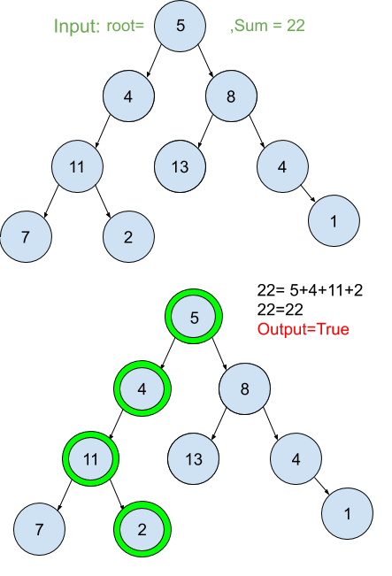

# Path Order
## Problem
Given a binary tree and a sum, determine if the tree has a root-to-leaf path such that adding up all the values along the path equals the given sum.

*__Note__*:<br> A leaf is a node with no children.

## Visual

## Algorthism
* Make a function with the input of a tree and sum.
* Check if there is a tree.
  * If not return false.
* Have hold varible that is false
* Make a helper function that take a node and set the counter to zero.
  * Add to the counter the value of the node.
  * If it node.left
    * Call the helper function with node.left and counter.
  * If it node.right
    * Call the helper function with node.left and counter.
  * If __not__ node.left __and__ __not__ node.right
    * If sum matchs the counter 
      * hold varible is true
* Call the helper funtion
* return the hold varible

## Pseudocode
```
START hasPathSum <-- FUNCTION(INPUT <-- root,sum )
  IF (root === null)
    RETURN FALSE
  END IF
  isIt <-- FALSE
  walk <-- FUNCTION(INPUT <-- node, counter <-- 0)
    counter <-- += node.value
    IF node.left
      walk(node.left, counter)
    END IF
    IF node.right
      walk(node.right, counter)
    END IF
    IF !node.left AND !node.right
      IF sum === counter
        isIt <-- TRUE
      END IF
    END IF
  END FUNTION
  walk(root)
  OUTPUT<-- RETURN isIt
```

## Code
Click ["here"](pathSum.js) to view code.

<hr>

[ ⏎ Back to Trees index ](../README.md) 

[〈 Previous: N-ary Tree Preorder Tranversal](../preOrder/README.md) | [Next: Range Sum of BST 〉](../rangeSum/README.md)
