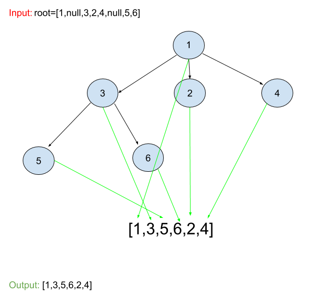

# N-ary Tree Preorder Traversal
## Problem
Given an n-ary tree, return the preorder traversal of its nodes' values.

Nary-Tree input serialization is represented in their level order traversal, each group of children is separated by the null value.

## Visual

## Algorthism
* Make a funtion that take in a root.
* make an empty array
* Check their is a root.
  * if not return results/ empty array
* Make a funtion that traverse through the tree with an input of a node.
  * push node values into the empty array.
  * for the length of the node.childern.
    * call on the fuction with the input being of the node.childern at index value.
* Call on the function to traverse through the tree with the input being the root.
* return arry  
## Pseudocode
```

```

## Code
Click ["here"](preorder.js) to view code.

<hr>

[ ⏎ Back to Trees index ](../README.md) 

[〈 Previous: N-ary Tree Postorder Tranversal](../postOrder/README.md) | [Next: Path Sum 〉](../pathSum/README.md)