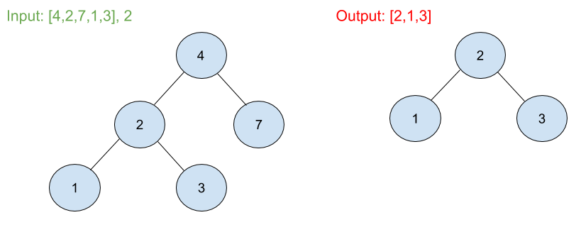

# Search in a Binary Search Tree
## Problem 
Given the root node of a binary search tree (BST) and a value. You need to find the node in the BST that the node's value equals the given value. Return the subtree rooted with that node. If such node doesn't exist, you should return NULL.

## Visual

## Algorthism
* Make a function that takes a root and a value
* If the root is null or, is the same value of the tree
  * Return the root
* If the value is less the root value
  * Then it gose to the left. In which the the function is called again with the root being left of the orginaly root.
* If value is more then the root val.
  * Then it gose to the right. In which the the function is called again with the root being right of the orginaly root.
## Pseudocode
```
START searchBST<-- FUNCTION (INPUT<-- root,val)
  IF root === NULL OR root.val === val
    RETURN OUTPUT <--root
  END IF
  IF val <  root.val
    RETURN searchBST(INPUT<-- root.left,val)
  END IF
  IF val > root.val
    RETURN searchBST(INPUT<-- root.right, val)
  END IF
  END
```
## Code
Click ["here"](searchTree.js) to view code.

<hr>

[ ⏎ Back to Trees index ](../README.md) 

[〈 Previous: Range Sum of BST](../rangeSum/README.md) 
